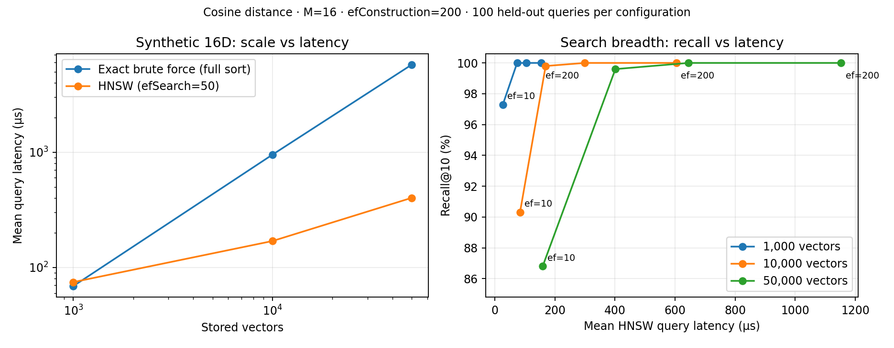
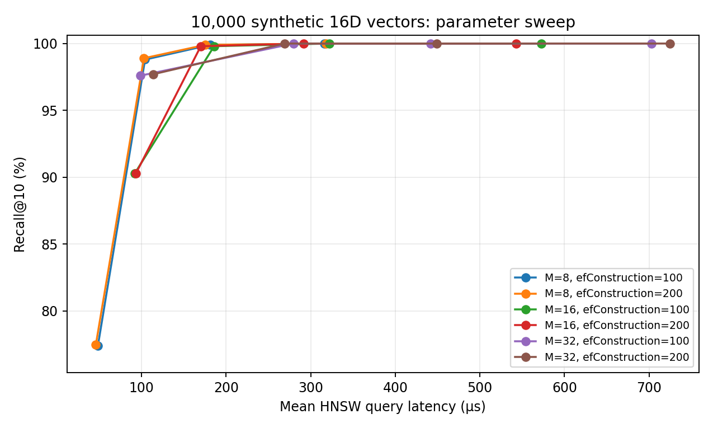

# Measured benchmark results

These are measurements from this development environment, not expected production performance.

## Dataset-size comparison

Cosine distance, 16 dimensions, M=16, efConstruction=200, efSearch=50, k=10. Each row averages 100 independently generated queries.

| Vectors | Recall@10 | Exact mean (µs) | HNSW mean (µs) | Exact/HNSW latency ratio | HNSW p95 (µs) | Build time (s) | Process peak RSS (KiB) |
|---:|---:|---:|---:|---:|---:|---:|---:|
| 1,000 | 100.000% | 69.0 | 74.6 | 0.92× | 89.1 | 0.29 | 10112 |
| 10,000 | 99.800% | 952.3 | 169.5 | 5.62× | 223.4 | 7.68 | 10112 |
| 50,000 | 99.600% | 5742.8 | 401.6 | 14.30× | 442.4 | 80.98 | 32996 |

At 1K vectors, HNSW is slightly slower in this configuration; graph-search overhead matters. At larger sizes it is faster than this repository's full-sort exact baseline. A faster exact baseline using a bounded heap or partial selection would change the comparison.



## Varied-vector-norm experiment

A separate 1K-vector, 100-query experiment uses 16D Gaussian coordinates multiplied by a random scale between 0.1 and 10, seed=42, k=10, efSearch=50. This is a targeted stress test for Euclidean/Manhattan graph neighborhoods, not a universal distribution.

| Implementation | Search metric | Cosine-built graph Recall@10 | Metric-matched graph Recall@10 |
|---|---|---:|---:|
| uploaded_upstream | euclidean | 98.0% | 50.9% |
| uploaded_upstream | manhattan | 98.0% | 57.9% |
| updated_fork | euclidean | 98.6% | 99.4% |
| updated_fork | manhattan | 98.5% | 99.2% |

The original nearest-only neighbor selection performs poorly when a metric-matched graph is built for this varied-norm dataset. The updated diversity rule improves those metric-matched results. Within the updated implementation, matching the construction/search metric also improves recall slightly relative to querying its cosine-built graph. These are separate effects; metric consistency alone did not produce the large before/after improvement.

## Parameter sweep

The CSV sweeps M={8,16,32}, efConstruction={100,200}, efSearch={10,50,100,200}, and k={1,5,10} at 10K vectors. More search breadth generally buys recall at additional latency; larger graph parameters also affect build costs and memory. Euclidean/Manhattan scale smoke evaluations are included at 1K vectors.



## Reproduce

```bash
make test build/benchmark build/metric-check
python3 benchmarks/run_sweep.py --sizes 1000 10000 50000 --m 16 --ef-construction 200 --output benchmarks/results-scale.csv
python3 benchmarks/run_sweep.py --sizes 10000 --m 8 16 32 --ef-construction 100 200 --output benchmarks/results-parameters.csv
python3 benchmarks/run_sweep.py --sizes 1000 --metrics euclidean manhattan --m 16 --ef-construction 200 --output benchmarks/results-metrics.csv
./build/metric-check > benchmarks/results-metric-consistency.csv
python3 benchmarks/compare_upstream.py --baseline /path/to/pre-update/main.cpp
python3 benchmarks/plot_results.py
```

Plotting requires matplotlib; the app and benchmark executables do not. The upstream comparison requires the original main.cpp; the uploaded original was used for the checked-in comparison. Keep it or retrieve the pre-update version from your Git history.

## Method and limitations

- Scale/sweep seed: 20261007. Database and query vectors are independently sampled from a standard normal distribution. No database vector is reused as a query. This is not a semantic/document dataset.
- HNSW random seed and insertion order are fixed. The benchmark runner builds one metric-specific graph at a time; the application's three simultaneous graphs have greater memory cost.
- Exact IDs use the existing full-sort brute-force implementation. Recall is the intersection of approximate IDs with exact top-k IDs divided by the exact result count, averaged across queries.
- Index search latency uses steady_clock; one untimed approximate warm-up is performed per configuration. Exact results are computed once per k, approximate results once per ef/k/query. These are not repeated production-load trials, and system scheduling can affect timings.
- Final sweeps run sequentially. Build time includes populating both the brute-force store and HNSW, not HTTP/network/embedding or persistence costs.
- RSS is the process high-water mark after construction (`getrusage` on Linux), including runtime, source vectors, graph, and process-launch overhead. It is not isolated index memory; small configurations can share the same reported floor.
- p50 and p95 are taken from the 100 measured approximate query latencies. No confidence intervals or multi-run variability estimates are provided.
- RAG tests use mock Ollama and do not assess real-model retrieval/answer quality. 16D synthetic performance must not be extrapolated to 768D semantic embeddings.
- Measurement date: 2026-10-07. Compiler and platform follow below.

```
g++ (Ubuntu 13.3.0-6ubuntu2~24.04) 13.3.0
Linux-6.18.44-x86_64-with-glibc2.39
```
